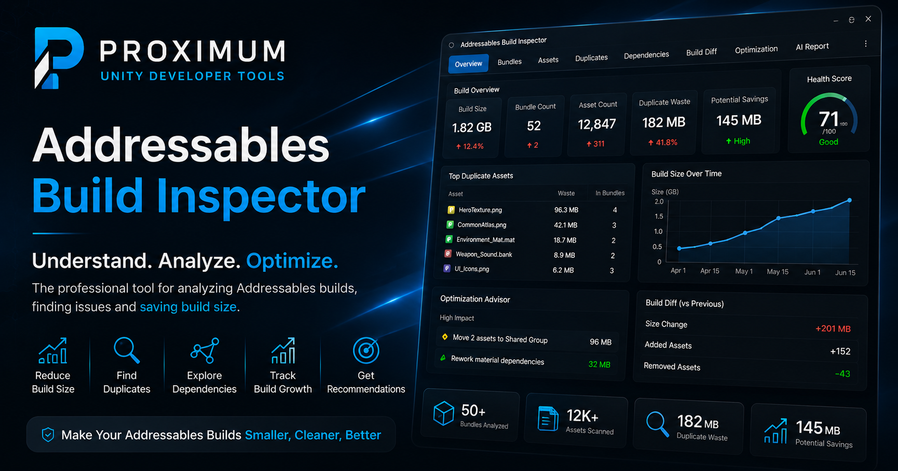

# Addressables Build Inspector

Editor window for reading Unity Addressables build layout reports. Loads a report (text or JSON) and turns it into sortable tables, duplicate detection, a dependency tree, build-to-build diffing, and an offline prompt generator for handing the results to an LLM.

[](https://github.com/proximummax/AddressablesUtility/actions/workflows/lint.yml)
[](https://github.com/proximummax/AddressablesUtility/actions/workflows/security.yml)
[](https://unity.com)



## Why

The stock Addressables build layout report is a large text file. Reading it by hand to find duplicated assets or to understand why something got included is slow, and doing that on every build is not realistic. This tool parses the report and gives you sortable views, duplicate ranking, dependency tracing, and diffing between two builds, so the questions that actually matter — what's bloating the build, what's duplicated, why is this asset here, what changed since last time — have direct answers instead of requiring manual digging.

Editor-only, no runtime footprint, no external package dependencies.

## Features

| Tab | What it does |
|---|---|
| Overview | Total build size, bundle and asset counts, duplicate count, estimated waste, largest bundle/asset |
| Bundles | Sortable table — name, size, asset count |
| Assets | Sortable table — name, path, size, bundle count |
| Duplicates | Every duplicated asset, ranked by estimated wasted size |
| Optimization | Classifies duplicate causes, suggests shared groups, simulates savings without touching the project, exports CSV/JSON/Markdown |
| Dependencies | Dependency tree and reverse references per asset, with circular-reference handling |
| Build Diff | Compares two reports: growth, count deltas, top-growing bundles, added/removed/modified assets |
| AI Report | Generates an offline, LLM-ready prompt from the loaded build data (several modes, see below) |

All tables are sortable by column. Exports run locally — nothing is sent anywhere.

## Installation

**Unity package**

1. Download `AddressablesUtility.unitypackage` from this repo, or get it from the [Asset Store](https://assetstore.unity.com/packages/tools/utilities/addressables-build-inspector-388716) (free).
2. `Assets → Import Package → Custom Package…`

**Copy the folder**

Copy `Assets/AddressablesBuildInspector` into your project's `Assets` folder. Editor-only, adds a single menu item.

**Requirements**

- Unity 2022.3 or newer
- An Addressables build layout report (text or JSON)
- No runtime dependencies, no external packages

## Quick start

1. Build your Addressables content to generate a build layout report.
2. Open `Tools → Addressables Build Inspector`.
3. Click **Load Report** and select the report file.
4. Check Overview, then Duplicates, then Optimization for the fastest wins.
5. Use Dependencies to see why a specific asset is included.
6. Use Build Diff to compare two reports and catch regressions before they ship.

The window remembers the last loaded report per user via `EditorPrefs`.

A synthetic sample report is included at `Assets/AddressablesBuildInspector/Samples/SampleBuildLayout.txt`, with `_Old`/`_New` variants for testing Build Diff.

## AI Report

The AI Report tab turns the loaded build data into a structured prompt you can paste into an LLM. Generated entirely offline — no API calls, no data leaves the Editor.

| Mode | Best for |
|---|---|
| Quick Review | A fast, high-level pass over the build |
| Optimization Consultant | Actionable recommendations to cut size |
| Build Growth Investigation | Explaining why a build got bigger |
| Duplicate Investigation | Root-causing duplication |
| Technical Audit | A detailed report for reviewers |

## JSON report schema

If you're feeding in JSON instead of the native text layout:

```json
{
  "bundles": [
    {
      "name": "remote.bundle",
      "FileSize": 2048,
      "assets": [
        { "name": "Hero.png", "path": "Assets/Textures/Hero.png", "Size": 1024 }
      ]
    }
  ],
  "dependencies": [
    { "source": "Assets/Hero.prefab", "target": "Assets/Textures/Hero.png" }
  ]
}
```

Size fields are matched flexibly (`sizeBytes`, `SizeBytes`, `FileSize`, `Size`, `TotalSize`) since different report producers use different naming.

## Duplicate waste formula

```text
EstimatedWaste = (BundleCount - 1) × AssetSize
```

A first-pass estimate of avoidable bundle growth from an asset being packed into more than one bundle.

## CI

Every push and pull request to `main` runs:

- **Lint** — markdown, YAML, and GitHub Actions workflow validation
- **Security** — [gitleaks](https://github.com/gitleaks/gitleaks) secret scanning across the diff and history

Status badges are at the top of this file and link to the workflow runs.

## Roadmap

- Screenshots/demo GIF for each tab
- UPM package support (`package.json` + git URL install)
- Automated EditMode tests in CI
- More AI report templates

Ideas and requests: [open an issue](../../issues).

## Bug reports and feature requests

[Open an issue](../../issues/new/choose) — there are separate forms for bug reports and feature requests that ask for the details needed to act on them (Unity version, report type, repro steps, etc).

## Contributing

Issues and PRs are welcome. For larger changes, open an issue first to align on the approach.

## License

See the [Asset Store EULA](https://unity.com/legal/as-terms) for the packaged release. A repository license file is planned; until then, treat this repo as source-available alongside the Asset Store listing.

## Links

- [Asset Store listing](https://assetstore.unity.com/packages/tools/utilities/addressables-build-inspector-388716) (free)
- [Full documentation](Assets/AddressablesBuildInspector/Documentation/README.md)
- [Setup guide](Assets/AddressablesBuildInspector/Documentation/Setup.md)
